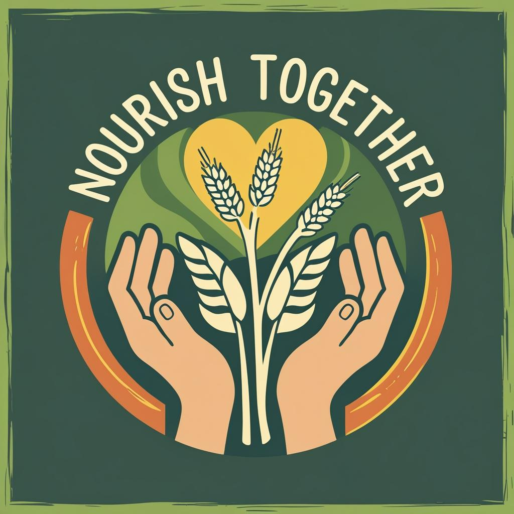

# Nourish Together

<p align="center">
  
</p>

## Contributors
Tammy Sisodiya, Ainan Ihsan, Silke Nodwell, Nino Godoradze 

## Project info
NourishTogether is a smart giving companion that helps people discover and support food-related charities and food banks - locally and globally - with transparency and purpose.

**Our mission:**

To simplify giving while building trust between donors and charitable organizations. By combining a charity recommender, location-based food bank search alongside an interactive map and a transparent donation tracking dashboard, we aim to create a more informed, engaged and confident donor experience.

## Features

- **UK charity recommender** - an interactive charity recommender that suggests UK-based charities based on the donor's interests and values.

- **Interactive UK and USA foodbank map** - an embedded map showing food bank locations in both the UK and USA.

- **Local search by location & country** - a smart search tool that helps users find nearby food banks based on their real-time location.

- **Donation journey dashboard** - a personalised dashboard that tracks the impact and journey of a donation, offering donors the transparency and honesty they need to feel confident about where their money is going.

**URL**: https://lovable.dev/projects/7ef69557-d6e8-415b-a1aa-6cddd06b655b

## What technologies are used for this project?

This project is built with:

Frontend: 
- Vite
- TypeScript
- React
- shadcn-ui
- Tailwind CSS

Backend:
- Node.js
- Python
- FastAPI
- Supabase

## Charity recommender API
We used a Sentence Transformer model to create embeddings for charity descriptions and save these in a FAISS Index for quick retrieval, enabling natural language search for charities.

The code for this API is a separate repo: [Recommender-FastAPI](https://github.com/ainanihsan/Recommender-FAST-API/). We've used Railway for CI/CD deployment.

This API is deployed at https://recommender-fast-api-production.up.railway.app/, with the Swagger docs at https://recommender-fast-api-production.up.railway.app/docs.

## How to run project & make edits

### Run project with Lovable

Simply visit the [Lovable Project](https://lovable.dev/projects/7ef69557-d6e8-415b-a1aa-6cddd06b655b). To make edits, you can prompt from the Lovable page directly.

Changes made via Lovable will be committed automatically to this repo.

### Run project locally

Follow these steps:

```sh
# Step 1: Clone the repository using the project's Git URL.
git clone <YOUR_GIT_URL>

# Step 2: Navigate to the project directory.
cd <YOUR_PROJECT_NAME>

# Step 3: Install the necessary dependencies.
npm i

# Step 4: Start the development server with auto-reloading and an instant preview.
npm run dev
```
